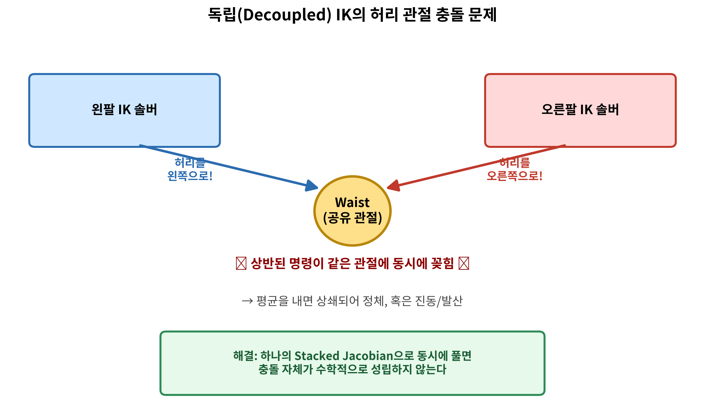
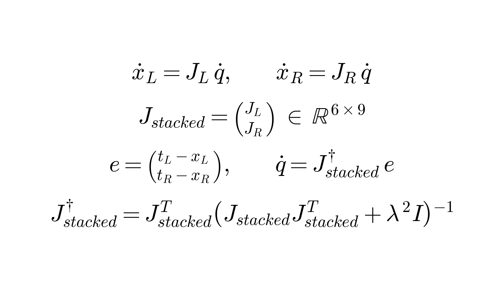
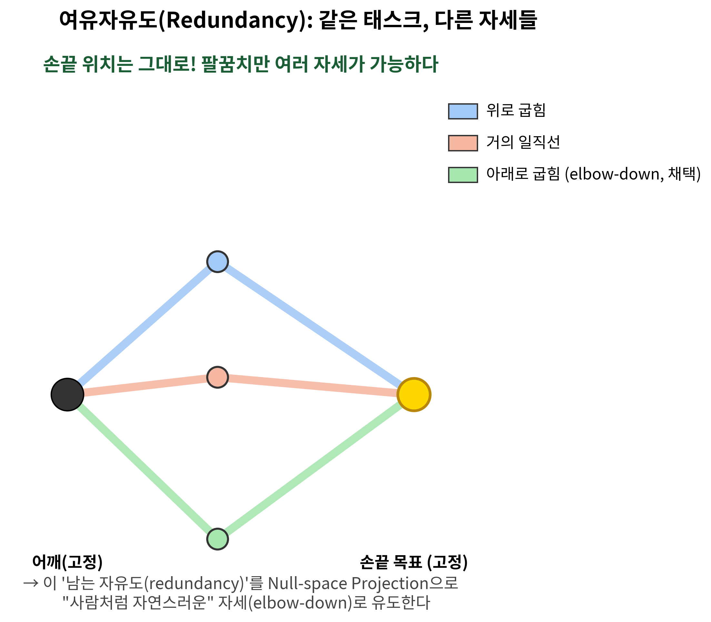
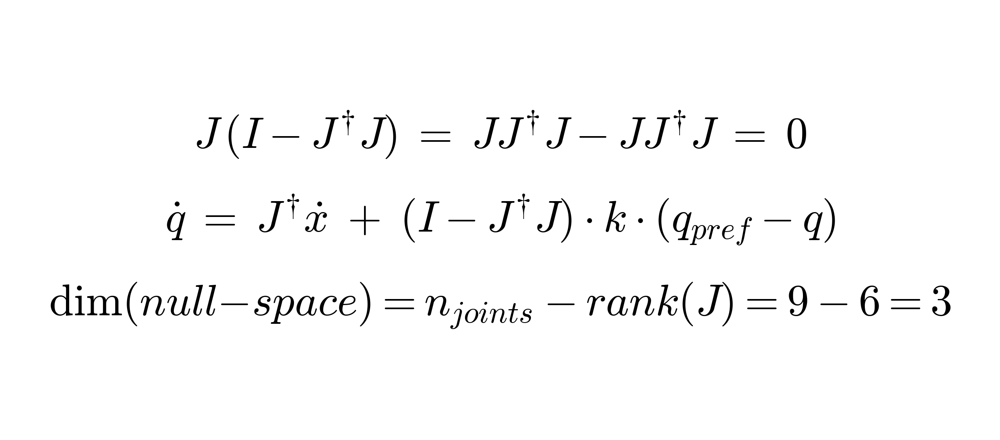

## 11자유도 양팔 로봇: Vision-guided Pick & Place

- 어드미턴스 제어 · Coupled IK · Null-space Projection
- 접촉 힘 제어와 여유자유도 기반 자세 최적화의 통합 구현

::: notes
안녕하십니까. 지금부터 11자유도 양팔 로봇의 Vision 기반 Pick & Place 시스템을 발표하겠습니다.
오늘 발표의 핵심은 이 로봇이 물체를 놓치지 않고, 사람처럼 자연스러운 자세로 잡을 수 있게
만든 세 가지 제어 메커니즘 — 어드미턴스 제어, Coupled IK, 그리고 Null-space Projection입니다.
:::

## 시스템 개요

- 11 DoF = Waist(1) + Head yaw/pitch(2) + 양팔 4×2 (shoulder pitch/roll/yaw, elbow)
- 손목(wrist) 관절 없음
- 제어 방식: Effort(토크) 제어, pinocchio RNEA로 역동역학 계산
- 파이프라인: Head 스캔 → ArUco 인식 → 접근(Coupled IK) → 파지(어드미턴스+Null-space) → 이송 → 복귀

::: notes
이 로봇은 총 11개의 자유도를 가집니다. 허리 1개, 목(Head) 2개, 그리고 양팔에 각각 어깨
피치·롤·요와 팔꿈치까지 4개씩 — 손목 관절은 없습니다. 제어는 위치가 아니라 토크(Effort)
레벨에서 이루어지고, pinocchio 라이브러리의 RNEA로 매 tick 실제 역동역학을 계산해 최종
토크를 산출합니다. 전체 동작은 Head가 자동으로 스캔해 ArUco 마커로 물체를 인식하고, Coupled
IK로 접근한 뒤, 어드미턴스와 Null-space Projection이 동시에 작동하는 구간에서 파지·이송·
복귀까지 이어지는 파이프라인입니다.
:::

## 이 발표의 구조 — 다룰 메커니즘 3가지

- ① 접촉을 어떻게 유지하는가 → **어드미턴스 제어** (힘 레벨)
- ② 양팔을 어떻게 동시에 움직이는가 → **Coupled IK** (기구학 레벨)
- ③ 팔꿈치를 어떻게 예쁘게 두는가 → **Null-space Projection** (여유자유도 레벨)

::: notes
오늘은 세 가지 층위의 문제를 순서대로 다룹니다. 첫째, 손이 물체에 닿았을 때 힘을 어떻게
제어하는가. 둘째, 양팔이 하나의 허리를 공유하는 상황에서 어떻게 동시에 움직이게 하는가.
셋째, 여러 자세가 가능한 상황에서 어떻게 사람처럼 자연스러운 자세를 고르게 하는가 — 이
순서로 진행하겠습니다.
:::

## PART A — 어드미턴스 제어 (힘 레벨)

## 지배방정식과 물리적 직관

- $M\ddot{e} + D\dot{e} + Ke = F_{ext}$   ($e = x_{actual} - x_{desired}$)
- $M$: 접촉 반응이 얼마나 "묵직한지" (가상 질량)
- $D$: 얼마나 "부드럽게" 멈추는지 (가상 댐핑)
- $K$: 목표에서 벗어나면 얼마나 "강하게" 되돌아오는지 (가상 강성)
- 임피던스: 오차 → 힘(토크)  [단일 루프, 이 로봇도 실제 성공]
- 어드미턴스: 힘 → 위치 기준  [이중 루프]
- **핵심**: 어드미턴스를 택한 이유는 "임피던스가 불안정해서"가 아니라, 축마다 다른 제어
  법칙(위치추종+순수 힘추종)을 섞고 싶었기 때문

::: notes
먼저 힘 제어의 핵심 방정식입니다. M, D, K로 이루어진 가상 스프링-댐퍼-질량 모델인데, 질량은
접촉 반응이 얼마나 묵직한지, 댐핑은 얼마나 부드럽게 멈추는지, 강성은 목표로 얼마나 강하게
되돌아오는지를 정합니다. 임피던스와 어드미턴스는 이 방정식을 어디에 쓰느냐가 다릅니다 —
임피던스는 오차를 바로 힘으로 바꾸는 단일 루프고, 어드미턴스는 힘을 위치 기준으로 바꿔서
별도의 위치 루프가 따라가는 이중 루프입니다. 저희는 사실 임피던스도 이미 성공적으로
구현했었습니다. 어드미턴스로 전환한 이유는 안정성 문제가 아니라, x와 y축은 계획된 궤적을
그대로 따르고 스퀴즈축만 순수 힘 제어로 하고 싶다는 요구사항 때문이었고, 이걸 궤적 레벨에서
처리하는 어드미턴스 구조가 훨씬 단순하게 표현됐기 때문입니다.
:::

## 실제 구현 — 축별 혼합 제어 법칙

- x, z축 (위치추종): $\ddot{x}_{cmd} = \ddot{x}_d - [D(\dot{x}_{cmd}-\dot{x}_d) + K(x_{cmd}-x_d)] / M$
- y축(스퀴즈, 순수 힘추종, K=0): $\ddot{y}_{cmd} = [F_{ext,y} - F_{d,y} - D\dot{y}_{cmd}] / M$   ($F_d = \pm10N$)
- $x_{cmd}$ → SolveIK_Position() → $q_{cmd}$ → PD + RNEA → 최종 토크

::: notes
실제 구현에서는 x와 z축엔 이 방정식을 그대로 위치추종에 쓰고, 스퀴즈 방향인 y축만 강성을
0으로 고정한 순수 힘추종 법칙을 씁니다. 목표 스퀴즈력은 좌우 각각 10뉴턴입니다. 이렇게
계산된 위치 명령을 매 tick 다시 역기구학으로 풀어서 관절각을 구하고, PD 제어와 RNEA
역동역학을 거쳐 최종 토크로 변환합니다. F/T 센서 원시값은 접촉 순간 노이즈가 심해서
10헤르츠 로우패스 필터를 거친 뒤에만 사용합니다.
:::

## 실측 데이터 — F/T 센서 그래프

- [사용자 삽입: 목표 스퀴즈력(±10N) vs 실제 도달 힘 시계열]
- [사용자 삽입: F/T 원시값 vs 10Hz LPF 필터 후 비교]

::: notes
[사용자 삽입] 실제 측정한 F/T 데이터를 보시면 ___. 목표 10N 대비 실제 도달률은 ___%였고,
필터 적용 전후로 노이즈가 ___만큼 줄었습니다.
:::

## PART B — Coupled IK (기구학 레벨)

## 문제: 공유 허리 관절

::: notes
양팔을 독립적으로 역기구학을 풀면 어떻게 될까요? 이 로봇은 왼팔과 오른팔이 하나의 허리
관절을 공유합니다. 왼팔 솔버는 물체에 다가가려고 허리를 왼쪽으로 틀라고 명령하고, 오른팔
솔버는 동시에 오른쪽으로 틀라고 명령합니다 — 같은 물리적 관절에 상반된 명령이 꽂히는
겁니다. 실제로 이 구조로 실험했을 때 왼팔은 마이너스 0.029, 오른팔은 플러스 0.029
라디안을 요구해서, 평균을 내면 거의 0으로 상쇄되며 로봇이 정체되는 현상이 실측으로
확인됐습니다.
:::

## Stacked Jacobian 수식 유도

두 손의 야코비안을 하나로 쌓으면, 허리는 "경쟁"이 아니라 "동시 만족"의 최적해가 된다

::: notes
해법은 두 손의 야코비안을 하나로 쌓는 것입니다. 왼손 위치 오차 3개, 오른손 위치 오차
3개를 세로로 쌓아 6행짜리 하나의 자코비안을 만들고, 감쇠 최소자승법으로 한 번에 풉니다.
이렇게 하면 허리 컬럼의 값은 왼손과 오른손 오차를 동시에 최소화하는 단 하나의 최적해로
자동 결정됩니다. 두 개의 경쟁하는 명령이 아니라 하나의 방정식이기 때문에, 충돌이라는
개념 자체가 수학적으로 성립하지 않습니다. 저희 로봇은 이 방식을 처음부터 채택했기 때문에,
방금 보신 허리 충돌 문제를 원천적으로 겪지 않았습니다.
:::

## PART C — Null-space Projection (여유자유도 레벨)

## 여유자유도(Redundancy)란?

::: notes
9개 관절으로 6차원 태스크, 즉 양손 위치만 맞추면 3개의 자유도가 남습니다. 손끝으로 책상
위 한 점을 가리키는 팔의 자세가 무수히 많은 것과 같은 원리입니다. 그런데 만약 손의
방향까지 맞추려고 하면 어떻게 될까요? 태스크 차원이 위치와 방향 합쳐서 12차원이 되는데,
관절은 여전히 9개뿐입니다. pinocchio로 실제 랜덤 자세 수백 번을 검증한 결과 이 경우
여유자유도가 정확히 0이 됩니다. 이게 바로 저희 로봇의 역기구학이 방향은 풀지 않고 위치만
푸는 이유입니다 — 방향까지 풀면 이 남는 자유도 자체가 사라져서, 뒤에서 설명할 자세 유도
기법을 쓸 수가 없습니다.
:::

## 수학적 증명 + Null-space 투영 공식

손끝 위치는 단 1mm도 안 흔들면서, 팔꿈치만 원하는 방향으로 유도한다

::: notes
핵심 증명은 한 줄입니다. J 곱하기 (I 마이너스 J의 의사역행렬 곱하기 J)는 항상 0입니다.
이 말은, 이 투영 행렬에 어떤 값을 넣어도 자코비안을 곱하면 0이 된다는 뜻이고, 곧 손끝
속도에 전혀 영향을 주지 않는다는 뜻입니다. 그래서 여기에 팔꿈치를 이런 자세로 두고 싶다는
선호값을 넣으면, 손끝은 그대로 둔 채 남는 자유도 안에서만 자세를 조정할 수 있습니다.
저희는 이 선호값으로 팔꿈치를 아래로, 어깨를 바깥으로 벌리는 값을 넣었고, 이 값의 부호는
이전에 400개 샘플 탐색과 실제 Gazebo 검증으로 이미 확정했던 값과 일치함을 재확인한 뒤
사용했습니다.
:::

## 실측 데이터 — Before/After 관절 마진

- [사용자 삽입: Null-space 적용 전(마진 0, 붕괴) vs 적용 후(마진 0.16~0.34rad 유지)]
- [사용자 삽입: posture_gain 스윕에 따른 위치오차 트레이드오프]

::: notes
[사용자 삽입] 실제로 측정해보니 Null-space 적용 전에는 관절 마진이 ___였고, 적용 후에는
___로 개선됐습니다. posture_gain을 ___까지 낮췄을 때 위치오차가 ___까지 줄었습니다.
:::

## 데모 영상

[사용자 삽입: 영상]

::: notes
말씀드린 세 가지 메커니즘이 실제로 어떻게 동작하는지 영상으로 보여드리겠습니다. 영상
재생. 보시는 것처럼 팔꿈치가 관절 한계에 부딪히지 않고, 사람처럼 자연스럽게 바깥으로
벌어진 채로 물체에 접근해서, 목표한 힘으로 스퀴즈를 유지하며 이송까지 완료하는 것을
확인하실 수 있습니다.
:::

## 마무리

- 수학(Coupled IK, Null-space)과 물리(접촉강성, 마찰, F/T 필터)를 함께 맞췄을 때만 실전에서 동작했다
- Q&A

::: notes
정리하면, 이 시스템은 수식으로 증명되는 기구학적 원리 — Coupled IK와 Null-space
Projection — 와, 접촉 강성이나 마찰, 센서 필터링 같은 물리적 튜닝이 함께 맞아떨어졌을
때만 실제로 동작했습니다. 이상으로 발표를 마치겠습니다. 질문 받겠습니다.
:::
